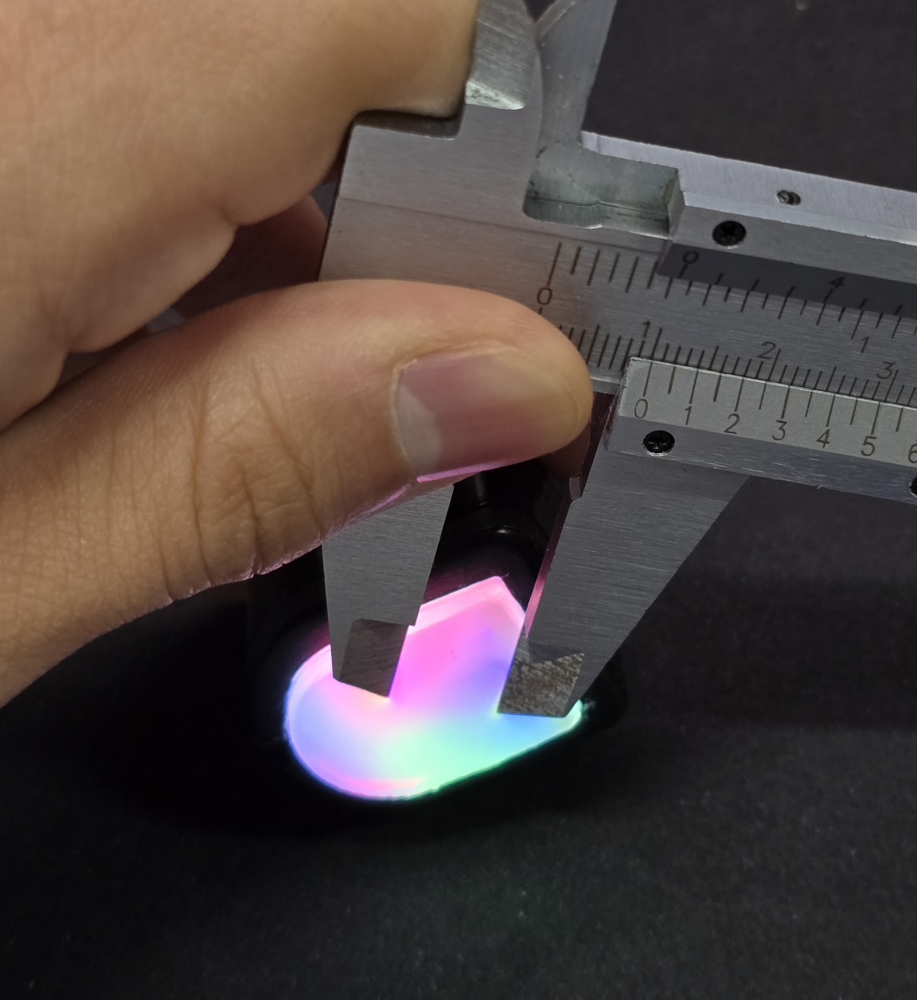
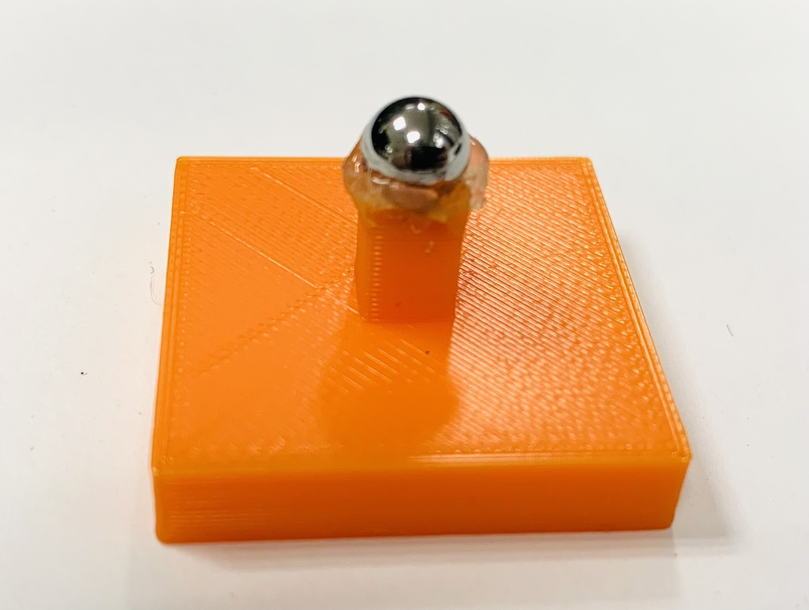
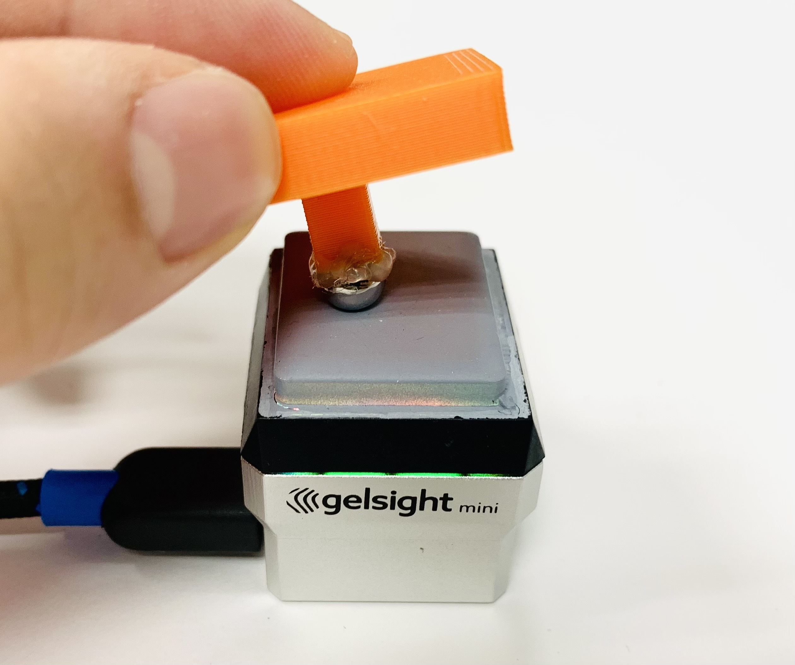
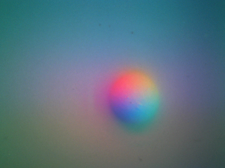
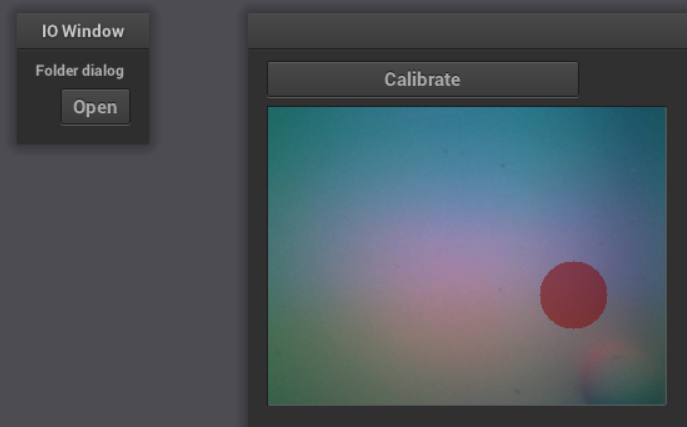

## Sensor Calibration
Refer to the original [gs-sdk/calibration](https://github.com/joehjhuang/gs_sdk/tree/master/calibration) for detailed explanation.

### Preperation
For a sensor with {serial} number, you need a {serial}.yaml inside sensors/{serial}/{serial}.yaml

### Pixel-per-millimeter Measurement
Borrowed from [digit-depth/scripts/mm_to_pix.py](https://github.com/vocdex/digit-depth/blob/main/scripts/mm_to_pix.py).
Press the sensor with a known length, such as a caliper. Press the two points for 5 tries. Copy the output and edit the corresponding sensor's yaml.
DO NOT PRESS THE SENSOR WITH THE TIP OF THE CALIPER. It will tear the gel. Press the caliper from the side.

```bash
mm_to_ppmm.py --serial SERIAL --distance_mm DISTANCE_MM [--frames N] [--sensors_root SENSORS_ROOT]
```

### Calibration Data Collection
| Ball Indenter | Collecting Data | Collected Image |
|---------|---------|---------|
|   |   |   |

To collect calibration data, use a ball indenter of known diameter to press against the sensor. Examples of the setup and resulting images are shown above.
```bash
collect_data.py --serial SERIAL --ball_diameter DIAMETER [--sensors_root SENSORS_ROOT]
```
* Instruction:
  * Save background image: Press 'b'
  * Capture 25 tactile images per 3 differnet diameter balls by pressing the ball in various locations: Press 'w'
  * Exit: Press 'q'
* Tips for Optimal Calibration:
  * Ball Size: Select a ball that appears well-sized within the sensor’s view, like the tactile image shown above; 4mm to 9mm is suitable for GelSight Mini.
  * Pressure: Avoid pressing too hard.
  * Coverage: Capture at least 50 images with the ball contacting different regions of the sensor.
  * Using Multiple Balls: Specify distinct `BALL_DIAMETER` values if balls in different size are applied.

### Label Collected Data
| NanoGui Screenshot |
|---------|
|   |

Run the command below to label the contact circle on the collected tactile data using NanoGUI:

```bash
python label_data.py --serial SERIAL [--sensors_root SENSORS_ROOT] [--display_difference] [--detect_circle]
```
* Instruction:
  * Click the **Open** icon to begin.
  * Keyboard Controls for aligning the label with the contact circle:
    * **Arrow keys (left/right/up/down)**: Adjust the circle's position.
    * **'m' / 'p'**: Decrease / increase the circle's radius.
    * **'f' / 'c'**: Decrease / increase the circle's movement step.
  * Once aligned, click the **Calibrate** icon.
  * After labeling all data, close the window to exit.

### Prepare Dataset
Run the command below to prepare the dataset for calibration model training:
```bash
python prepare_data.py --serial SERIAL [--sensors_root SENSORS_ROOT] [--radius_reduction RADIUS_REDUCTION]
```

### Train Calibration Model
Train the MLP model to map pixel color and location (RGBXY) to surface gradients for each pixel. Use the following command to train the model with the collected dataset:
```bash
python train_model.py --serial SERIAL [--sensors_root SENSORS_ROOT] [--n_epochs N_EPOCHS] [--lr LR] [--device {cpu, cuda}]
```

The trained model is saved in `CALIB_DIR/model/nnmodel.pth`.

## Test the Trained Calibration Model
Once the model is trained, connect the sensor and run the following command to stream images and perform real-time surface reconstruction using the trained calibration model:

```bash
python test_model.py --serial SERIAL --sensors_root SENSORS_ROOT [--device_type DEVICE_TYPE] [--mode MODE] [--use_mask]
```
After starting, wait briefly for background data collection; real-time surface gradient predictions will then be displayed. Press any key to exit.


### References
1. S. Wang, Y. She, B. Romero, and E. H. Adelson, “Gelsight wedge:
Measuring high-resolution 3d contact geometry with a compact robot
finger,” in 2021 IEEE International Conference on Robotics and
Automation (ICRA). IEEE, 2021.
